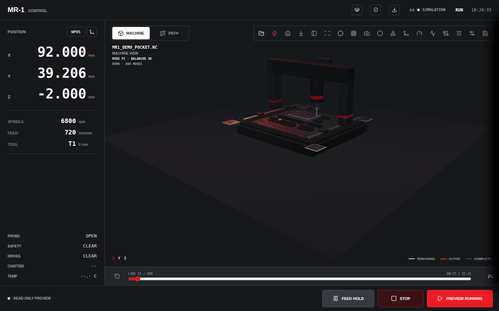
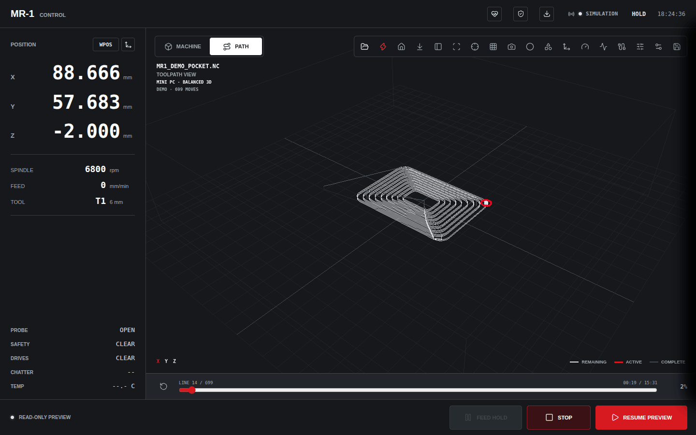
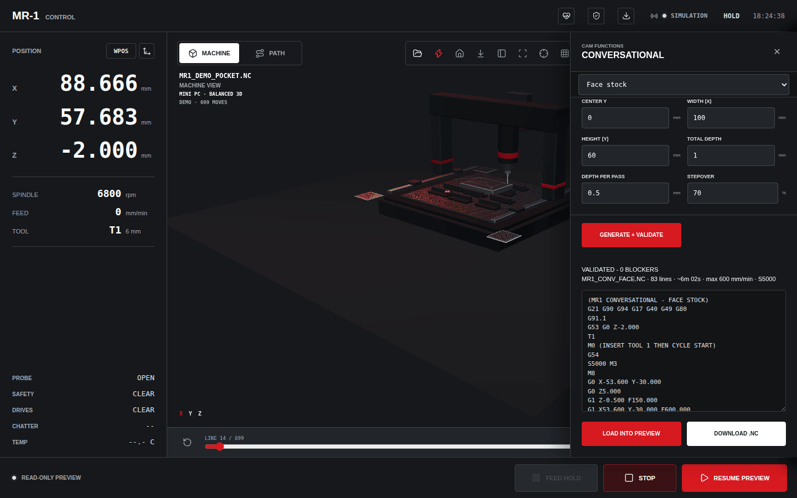
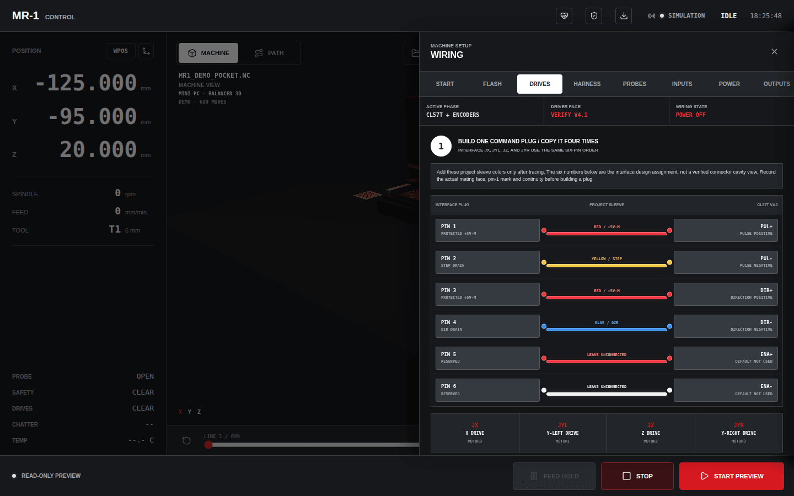
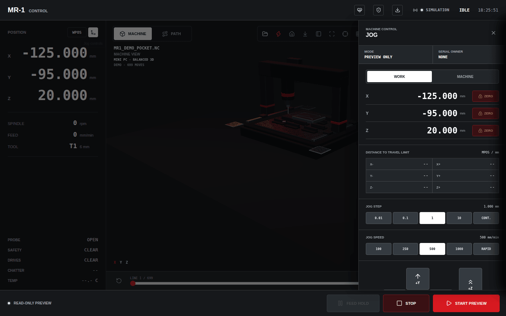
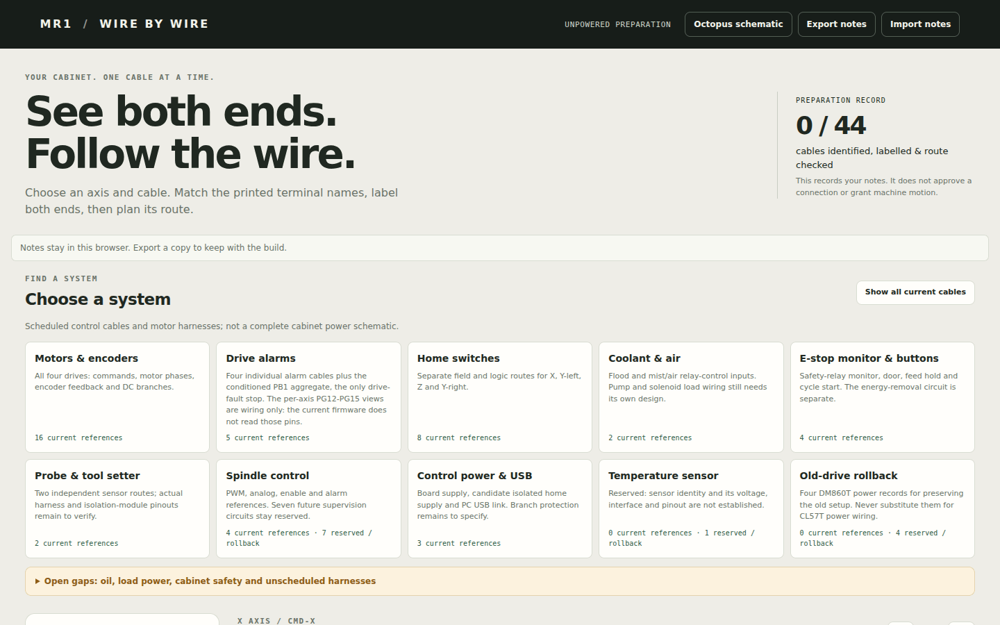
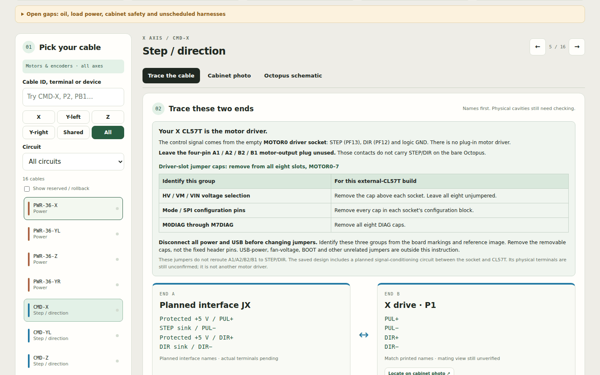
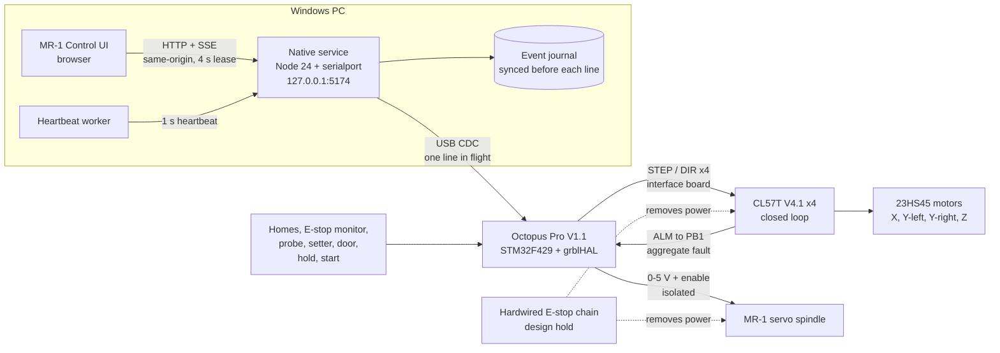

<div align="center">

# MR-1 Control

**A fail-closed Windows controller, wire-by-wire wiring guide and grblHAL firmware tree<br/>
for a Langmuir MR-1 mill retrofit on a BIGTREETECH Octopus Pro.**

[](https://github.com/DeadlySIn777/FluidNC-OCTOPUS-PRO-GRBLHAL/actions/workflows/source-checks.yml)


[](LICENSE)



</div>

> [!WARNING]
> **Engineering source, not a machine release.** Nothing here has been run on the physical
> machine yet: no controller connection, flashing, motion or E-stop test. Software checks use
> synthetic controllers. The software STOP is not an E-stop, and the hardwired stop chain is
> still a blocking design hold. See [what's left](#status) before wiring or energizing anything.

## Contents

- [What's in the box](#whats-in-the-box)
- [Machine at a glance](#machine-at-a-glance)
- [Screenshots](#screenshots)
- [How it fits together](#how-it-fits-together)
- [Safety model](#safety-model)
- [Quick start](#quick-start)
- [Wiring guide](#wiring-guide)
- [Repository map](#repository-map)
- [Documentation](#documentation)
- [Testing and CI](#testing-and-ci)
- [Status](#status)
- [Earlier project](#earlier-project)
- [License](#license)

## What's in the box

| | |
| --- | --- |
| **MR-1 Control** · [`mr1-control/`](mr1-control/README.md) | Browser interface plus a local Node.js serial service that owns the controller: exclusive leases, typed commands, read-only preflight, durable journaling, NC validation, probing, conversational CAM, toolpath preview and staged commissioning. |
| **Wire-by-wire guide** · [`docs/wiring/`](docs/wiring/README.md) | One offline HTML page that traces all 56 scheduled cables end to end, plus an Octopus board view, the cable schedule, the I/O manifest and the 66-setting profile. |
| **Firmware tree** · [`grblHAL-STM32F4/`](grblHAL-STM32F4/SOURCE-PROVENANCE.md) | The complete exported grblHAL STM32F4 driver with the MR-1 board map and profile, pinned component revisions and a hash-checked source manifest. |

The repository keeps its original FluidNC name, but this configuration runs **grblHAL**. gSender is not needed.

## Machine at a glance

| | |
| --- | --- |
| **Machine** | Langmuir MR-1 mill retrofit · travel 566 × 546 × 155 mm |
| **Controller** | BIGTREETECH Octopus Pro V1.1 · STM32F429ZGT6 · grblHAL core `779d41b8` |
| **Motion** | 4 × StepperOnline CL57T V4.1 closed-loop drives with 23HS45 3.0 Nm motors<br/>X · Y-left · Y-right · Z, with dual-Y auto-squaring on home |
| **Rates** | X/Y 2540 mm/min · Z 1016 mm/min · homing Z, then X, then Y |
| **Spindle** | Stock MR-1 AC servo, 0–8000 RPM · isolated 0–5 V command and forward enable<br/>RS-485 digital path designed but locked |
| **Inputs** | 4 homes, E-stop monitor, feed hold, cycle start, door, probe, tool setter, aggregate drive fault |
| **Host** | Windows PC · Node.js 24 · UI served on `http://127.0.0.1:5174` |

Drive signals come from the Octopus **empty driver sockets** through a qualified interface board.
The A1/A2/B2/B1 motor-output plugs are not STEP/DIR outputs.

## Screenshots

<table>
  <tr>
    <td width="50%"><br/><sub><b>Toolpath view.</b> Background G-code parsing, remaining, active and complete segments, and a timeline scrubber.</sub></td>
    <td width="50%"><br/><sub><b>Conversational CAM.</b> Every generated program runs through the MR-1 NC validator. Note XY is positioned at the retract height before Z descends.</sub></td>
  </tr>
  <tr>
    <td width="50%"><br/><sub><b>In-app wiring.</b> One command plug built four times; ENA stays reserved and unconnected.</sub></td>
    <td width="50%"><br/><sub><b>Jog.</b> Bounded single steps only, with the serial owner and travel limits shown. The preview has no machine authority.</sub></td>
  </tr>
  <tr>
    <td width="50%"><br/><sub><b>Wire by wire.</b> Pick a system, and open gaps are listed up front.</sub></td>
    <td width="50%"><br/><sub><b>Cable trace.</b> Both ends of every cable, the jumper groups to remove, and what remains unverified.</sub></td>
  </tr>
</table>

<sub>Captured from the source build in simulation mode. No firmware, controller or proprietary CAD was loaded.</sub>

## How it fits together



The browser never talks to the serial port. The native service is the only machine authority, and it starts disconnected.

## Safety model

The software is built to **fail closed**: missing evidence never turns into permission.

- **Pinned firmware.** The service refuses to start unless the exact firmware image is present: 221,304 bytes, SHA-256 `F4AB32BD…E9D`. There is no bypass flag.
- **Read-only preflight.** Board identity and all 66 pinned `$` settings are read and compared before anything can arm. A mismatch blocks.
- **One owner, short lease.**
  - A 4 s browser lease is renewed by a dedicated worker, so hidden tabs aren't throttled into a stop.
  - A frozen page still lets the lease lapse: after 3 s while visible, 90 s while hidden.
  - Closing the tab stops the machine.
- **Streaming discipline.**
  - One acknowledged line is in flight at a time, and no line is ever retransmitted.
  - Every line is journaled to disk before it is sent. If a journal write fails, the command is blocked.
- **Stops stay reachable.**
  - Hold, stop, jog cancel and disarm need only a same-origin request, not the lease.
  - A crash, closed console window or Ctrl+Break sends hold + reset.
  - Jog cancel uses grblHAL's `0x85`.
- **NC validator.** Every program is checked before it reaches the controller. It blocks:
  - motion before the first `G53` retract
  - Z moves before XY is re-established after a retract or offset change
  - anything outside the qualified G/M subset: M4 reverse, G41/G42 cutter compensation, canned tapping, rotary words and more
  - bad arc geometry and feed, Z-feed and spindle-speed ceilings
  - realtime characters, nested comments and oversized lines
- **Staged commissioning.** Motion stays locked until each stage has recorded physical evidence.

> [!IMPORTANT]
> None of this replaces a hardwired, fail-safe E-stop that removes hazardous energy. That design is still an open hold. See [Status](#status).

## Quick start

Use **Node.js 24** on Windows with a local checkout. In PowerShell:

```powershell
cd mr1-control
npm ci
npm run build
npm test
```

**Look around without hardware.** Start the development preview. It needs no firmware or controller.

```powershell
npm run dev          # then open http://127.0.0.1:5173/
```

**Run the native controller.** The service needs the exact pinned firmware file. The public tree has its hash, manifest and source, but not the binary. Import it by following [local assets](docs/LOCAL-ASSETS.md), rebuild, then:

```powershell
npm run controller   # then open http://127.0.0.1:5174/?native=1
```

`START-MR1-SOURCE.cmd` is an equivalent foreground launcher. No COM port opens automatically. Choosing a port and commissioning are always explicit operator steps.

## Wiring guide

Open [`docs/wiring/visual/index.html`](docs/wiring/visual/index.html) from your local checkout. It works offline; only the BIGTREETECH board photo loads from the publisher.

- **Trace the cable.** Pick an axis or system and see both ends, terminal names and the planned route.
- **Octopus schematic.** Board headers, driver-slot jumper groups and named terminal destinations.
- **Cabinet photo.** Locate the ends on the real cabinet.
- **Notes.** Mark each cable identified, labelled and route-checked, and export your notes with the build.

Start with the [readiness worksheet](docs/wiring/MR1-wiring-readiness.md): it lists the blocking holds before energizing.

## Repository map

| Path | Contents |
| --- | --- |
| [`mr1-control/`](mr1-control/README.md) | Windows application: UI (`src/`), native service (`service/`), tests, CAM posts, packaging |
| [`docs/wiring/`](docs/wiring/README.md) | Wiring plan, CL57T setup, interface board, cable schedule, I/O manifest, settings profile, visual guide |
| [`tools/visual-wiring/`](tools/visual-wiring/README.md) | Generator and data for the visual guide (rebuilt reproducibly in CI) |
| [`grblHAL-STM32F4/`](grblHAL-STM32F4/README.md) | Exported firmware source: MR-1 map in `boards/`, profile in `Inc/`, machine docs in `mr1/` |
| [`tools/`](tools) | Hash-pinned local asset importer and wiring sync |
| [`docs/`](docs) | Distribution scope, local assets, README media |
| [`legacy/`](legacy/fluidcnc-2025/README-LEGACY.md) | The archived FluidCNC project and the old bench scripts (do not run them) |

## Documentation

| Topic | Read |
| --- | --- |
| Native controller behavior | [NATIVE_CONTROL.md](mr1-control/NATIVE_CONTROL.md) · [Windows operator architecture](mr1-control/WINDOWS_OPERATOR_ARCHITECTURE.md) |
| Commissioning and operation | [COMMISSIONING.md](grblHAL-STM32F4/mr1/COMMISSIONING.md) · [OPERATOR.md](grblHAL-STM32F4/mr1/OPERATOR.md) |
| Wiring | [WIRING.md](docs/wiring/mr1/WIRING.md) · [short check card](docs/wiring/mr1/WIRING_SIMPLE.md) · [CL57T setup](docs/wiring/mr1/CL57T_QUICK_WIRING.md) · [interface board](docs/wiring/mr1/INTERFACE_BOARD.md) |
| Spindle | [Spindle supervision](docs/wiring/mr1/SPINDLE_SUPERVISION.md) |
| Parts | [BOM](docs/wiring/mr1/BOM.md) · [order list](docs/wiring/mr1/ORDER_LIST.md) |
| CAM posts | [Post contract](mr1-control/post-processors/README.md) |
| Firmware | [Provenance and upstream delta](grblHAL-STM32F4/SOURCE-PROVENANCE.md) · [known issues](grblHAL-STM32F4/FIRMWARE-KNOWN-ISSUES.md) |
| Assets and licensing | [Local assets](docs/LOCAL-ASSETS.md) · [distribution scope](docs/DISTRIBUTION.md) · [third-party notices](mr1-control/THIRD-PARTY-NOTICES.md) |
| Project | [Contributing](CONTRIBUTING.md) · [security and control boundaries](SECURITY.md) |

## Testing and CI

Every push and pull request runs **MR1 source checks** on `windows-latest`:

- firmware source-export integrity, the settings profile, macros and workflow tests
- visual-guide data checks, model tests, and a byte-identical rebuild of the committed guide
- the local asset importer's safeguards
- `npm ci`, `npm run build` and the full `npm test` suite (about 600 tests)

Tests use synthetic serial ports and temporary journals; they never open a real COM port. Tests that need optional local files (firmware image, CAD, vendor images) report **SKIP** when those files are absent.

## Status

**Software**
- [x] Full audit of the app, service, validator, CAM, wiring data, firmware tree and legacy archive
- [x] Audit defects fixed, each with regression tests; CI green on Windows

**Hardware and design holds, before energizing**
- [ ] Hardwired stop chain and cabinet power design: contactor or STO for the spindle servo, Z-drop analysis, coolant in the stop chain
- [ ] Safety relay selection and the E-stop monitor contact (closed while healthy, never an NC auxiliary)
- [ ] Interface-board protection values (series R, TVS, pull-ups, RC) and guarding the onboard SW2 that shares PB2
- [ ] ENA wiring versus a motion-power interlock, and STEP/DIR behavior during controller reset
- [ ] Qualify the PB1 aggregate fault chain before any coupled dual-Y motion

**Next firmware candidate:** see [known issues](grblHAL-STM32F4/FIRMWARE-KNOWN-ISSUES.md)
- [ ] Status reports during homing, reading the per-axis faults on PG12–PG15, lab-image output claims and a pinned toolchain

**Physical commissioning**
- [ ] Every stage in [COMMISSIONING.md](grblHAL-STM32F4/mr1/COMMISSIONING.md): board identity, inputs, drives, homing, motion, probing, spindle, first cut

## Earlier project

The previous FluidCNC system (F446/TMC2209, Python bridge, Raspberry Pi and Le Potato setup, ESP32 VFD and chatter firmware, camera) is preserved byte-for-byte under [`legacy/fluidcnc-2025`](legacy/fluidcnc-2025/README-LEGACY.md). The old firmware-tree bench scripts live in [`legacy/grblhal-diagnostics-2025`](legacy/grblhal-diagnostics-2025/README.md). They can write settings, disable limits and move motors, so **never run them** against the MR-1.

## License

Project-authored code is under the repository's [MIT license](LICENSE). Firmware and third-party components keep their own licenses; see [distribution notes](docs/DISTRIBUTION.md) and the [complete notices](mr1-control/THIRD-PARTY-NOTICES.md).

This project is independent of Langmuir Systems, BIGTREETECH and StepperOnline.
