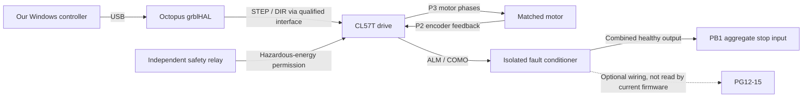

# MR1 wiring readiness and field worksheet

**Second-pass update:** module supplies/terminals, physical connector orientation, FAN voltage selection, alarm aggregation and power-up instructions were corrected. Read [MR1-wiring-second-pass.md](<MR1-wiring-second-pass.md>) before using the refreshed bundle. Secure the test motor and support gravity-loaded Z before any permitted bench energization; a stopped command stream does not prevent holding torque or shaft movement.

Audit date: 2026-09-24. Active design: Octopus Pro **v1.1 / STM32F429ZGT6**, four **CL57T V4.1** drives, four **23HS45-4204D-E1000** motors. Nothing was connected, energized, flashed, or moved during this audit. All physical acceptance boxes below remain open.

The firmware and application agree on the 31 assigned GPIOs. This establishes the intended electrical signals, not which way a physical plug is facing. The remaining work is now separated into buildable signal assignments, measurements needed before energizing, and tests needed before cutting. The machine is **not released for machining** by this document.

## What the closed loop actually does

The Windows controller sends commands over USB. grblHAL generates step/direction signals. Each CL57T drives its motor and reads that motor's encoder locally. The PC does not receive independent motor or table position through this interface. A reported commanded coordinate cannot prove that a coupler, ballscrew, or gantry moved correctly.

The drawing is functional. It does not specify a mains circuit or approve the still-unbuilt interface electronics.

## Source baseline

Firmware baseline: commit `fbd4eb786eabfbe3d5fe87fc84ceb2bc59a47d64`. Audit documentation/profile/validator commit: `41134da4eaea8ac7f64f7dd69b89e9312e228147`. Existing user edits under `mr1/wiring-map` were read only and preserved. Corrected documents, vendor manuals and relevant source snapshots are collected in the [local wiring reference bundle](<README.md>). No original Drive path is needed to inspect the evidence. No firmware code, stored settings, or pin assignments changed.

In the reference bundle, the firmware snapshots are under `source/`, corrected documents/data under `mr1/`, vendor files under `mr1/_vendor_docs/`, and the application wiring snapshot under `application-reference/`. Line numbers identify source, not a physical connector cavity. This bundle is a reference collection, not a complete firmware build tree.

| ID | Exact source | What it establishes |
| --- | --- | --- |
| F1 | `platformio.ini:83`, `Inc/mr1_octopus_config.h:1` | Dedicated production target force-includes this configuration; legacy `my_machine.h` is not the production authority. |
| F2 | `boards/btt_octopus_pro_mr1_map.h:40`, `:68`, `:110`, `:126`, `:142`, `:183` | Motion, home, diagnostic, output and control GPIO assignments. |
| F3 | `Inc/mr1_octopus_config.h:57`, `:72`, `:93`, `:111`, `:119`, `:123`, `:133`, `:137` | Timing, scale, homing sequence, polarity and spindle defaults. |
| F4 | `Src/driver.c:1662`, `:3342`, `:3465`; `grbl/protocol.c:130`, `:531` | PB1 enters the motor-fault control path; per-axis fault pins are enumerated but never read (`get_motor_fault_inputs()` has no caller in this board build). |
| F5 | `mr1/expected-settings.json:1` | Original 65-setting baseline; isolated corrected profile and application copy now contain 66 checks, adding explicit `$13=0` millimeter reporting. |
| F6 | `grbl/config.h:768`, `grbl/nuts_bolts.h:35`, `grbl/settings.c:77`, `grbl/report.c:204` | `DEFAULT_REPORT_INCHES` inherits `Off=0`; stored `$13` controls reported coordinate/rate units independently of program G20/G21. |
| A1 | `application-reference/wiring-installation.js:459` | Application's 31 GPIO assignments match F2. |
| D1 | `mr1/INTERFACE_BOARD.md`, Motion Outputs / External-Drive Alarm Inputs / Probe and Tool Setter | Intended interface, isolation, alarm-supervision and hardware acceptance requirements. |
| D2 | `mr1/PIGTAIL_SCHEDULE.md`, Octopus headers / CL57T connectors / Stock harnesses | Project connector schedule; physical orientation and mating parts remain fit checks. |
| D3 | `mr1/SPINDLE_SUPERVISION.md:270`, `:312`; `mr1/servo-profile.pending.json:1` | Candidate servo family and unresolved analog scaling; control permits remain false. |
| V1 | [CL57T V4.1 manufacturer manual](https://www.omc-stepperonline.com/download/CL57T-V41_user_manual.pdf), sections 2, 3, 5, 6, 7 | Drive connector functions, limits and switches. Local copy `mr1/_vendor_docs/CL57T-V41_user_manual.pdf`, SHA-256 `3eec9304c770ff68a5ccbd68f105789edfb35f5c91a9977531a30756a918d7da`. |
| V2 | [Motor manufacturer specification](https://www.omc-stepperonline.com/nema-23-closed-loop-stepper-motor-3-0nm-424oz-in-encoder-1000ppr-4000cpr-23hs45-4204d-e1000) | 4.2 A/phase, 1.8° step, 8 mm shaft; actual labels and mechanical fit still require inspection. |
| V3 | [BTT official Octopus Pro source](https://github.com/bigtreetech/BIGTREETECH-OCTOPUS-Pro); archived `mr1/_vendor_docs/BTT_Octopus_Pro_V11-sch.pdf` and `BTT_Octopus_Pro_V11-Pin.jpg` | Board reference material. Match the physical revision, silkscreen and connector orientation before termination. |

## Motor command assignments

All PUL/DIR connections pass through the qualified common-anode interface. Do not connect a GPIO directly to a drive input or mistake the board's motor-phase screw terminals for command outputs. Use the **driver sockets**, with no plug-in stepper driver installed. [F2, D1, D2]

| Axis | Socket | STEP source → P1 PUL− interface | DIR source → P1 DIR− interface | Reserved EN source, unused by default |
| --- | --- | --- | --- | --- |
| X | MOTOR0 | PF13 | PF12 | PF14 |
| Y-left | MOTOR1 | PG0 | PG1 | PF15 |
| Z | MOTOR2 | PF11 | PG3 | PG5 |
| Y-right | MOTOR3 | PG4 | PC1 | **PA2, v1.1 only** |

Project socket-adapter schematic identities are EN 1, STEP 7, DIR 8, logic GND 9; EN is reserved and unconnected in the active eight-channel PUL/DIR build; unused contacts remain unpopulated. These are schematic contact identities, **not permission to count pins from an unverified view**. Record the actual board orientation, pin-1 feature, keying and continuity before fitting an adapter. Remove the prescribed driver power, mode/SPI and DIAG jumpers only after matching each block to the actual board reference. The v1.0 MOTOR3 enable assignment differs. [F2, D2]

## Drive-side worksheet

The following is the existing project starting configuration, verified against the manufacturer tables. It is not a record of switches actually inspected. [V1 §§3, 5–7; F3]

| Item | Intended value or function | Physical record |
| --- | --- | --- |
| S1 | 4: 4 A RMS / 5.6 A peak, initial gain preset | X___ YL___ Z___ YR___ |
| S2 SW1–4 | ON / OFF / ON / ON; 1600 pulses/revolution | X___ YL___ Z___ YR___ |
| SW5 | OFF initially; physical direction remains unverified | X___ YL___ Z___ YR___ |
| SW6 / SW7 / SW8 | OFF / OFF / OFF; closed loop / PUL-DIR / 1.5 ms filter | X___ YL___ Z___ YR___ |
| S3 | 5 V command level | X___ YL___ Z___ YR___ |
| P1 | PUL±, DIR±; ENA unconnected; ALM/COMO through conditioning; BRK unused | Photo / orientation___ |
| P2 | EA±, EB±, drive-supplied VCC, EGND | Matched harness IDs___ |
| P3 | A±, B± motor phases | Harness/continuity record___ |
| P4 | Polarized +VDC/GND; separate fused 36 V star pair per drive | Markings/polarity___ |
| P5 | RS232 tuning only | No control connection |

The drive allows 18–50 VDC; transients also count. PUL/DIR requires at least 1 μs pulse width and 2 μs direction setup. Firmware requests 5 μs and 6 μs; these values still need checking at the loaded drive input. Never apply 24 V to inputs selected for 5 V. P2 VCC is an output, not an external-power input. The manual does not establish internal galvanic isolation of its encoder supply. [V1 §§2, 3, 6, 7]

No motor wire colors, GX16 cavity assignments or extension pin numbers are approved here. Use the matched factory harness and verify continuity while de-energized. Do not swap phases as an improvised direction fix without checking encoder phase relationship. Record direction configuration after controlled tests.

## Inputs and fault behavior

| Function | Header / GPIO | Required logic / routing | Physical evidence |
| --- | --- | --- | --- |
| X home | STOP0 / PG6 | Healthy low; trigger/open/lost field power high | ____ |
| Y-left home | STOP1 / PG9 | Same, independently sensed | ____ |
| Z home | STOP2 / PG10 | Same | ____ |
| Y-right home | STOP3 / PG11 | Same, independently sensed | ____ |
| X / YL / Z / YR per-axis fault | STOP4–7 / PG12–15 | Wiring for a future firmware candidate only; the current firmware never reads these pins (no stop, no status, no per-axis indication) | ____ |
| Aggregate fault | EXP2 / **PB1** | Combined conditioned healthy output low; any fault/open/power loss high | ____ |
| E-stop monitor | TB / PF3 | Safety-relay contact closed to GND while the relay is energized, open on E-stop/trip/broken wire (not an NC auxiliary; relay/terminal HOLD); never invert `$14` to suit a wrong contact; does not replace energy removal | ____ |
| Door monitor | PWR-DET / PC0 | NC monitor; adjacent power cavity unused | ____ |
| Feed hold | T0 / PF4 | NC contact | ____ |
| Cycle start | EXP2 / PB2 | Guarded NO contact | ____ |
| Touch probe | T1 / PF5 | Isolated output low on trigger; `$6=3` | ____ |
| Tool setter | BLTouch-labelled header / PB7 | Independent isolated low-on-trigger input; BLTouch plugin disabled | ____ |

Source: F2–F5 and D1. Populate signal and verified logic return only. STOP-header 5 V cavities remain empty. PB7 uses its verified adjacent GND; do not populate PB6 or the header's 5 V cavity. Probe field supply/return and controller-side HW-399 HVCC/HGND must remain separated. The installed HW-399/TLP281 module circuit and sensor pinout remain unverified; a generic module name does not establish its terminals. Do not leave shared output VCC floating as a generic recipe: pullups may couple channels. Trace the actual circuit and test combinations, either side unpowered, open cables and lost field power before connecting GPIO.

**Alarm topology:** each raw ALM/COMO pair needs its own isolated, current-limited conditioner. Combine the proven **conditioned healthy outputs** for PB1, the only drive-fault stop; optional outputs for PG12–15 are wiring only and are not read by the current firmware. Raw alarm transistors are not assumed dry contacts and must not be series-chained directly into PB1. Healthy-open alarm behavior cannot be made cable-break-safe by inversion alone; it needs added supervision or a separate ready/power contact. Test healthy, alarm, power loss and cable open independently on all four channels. Use an approved fault method; never hot-unplug a motor or encoder or put an ohmmeter across an energized output. [D1, F4]

The stock home harness needs four independently proven channels. Conductor count is a clue, not proof. Direct connection is acceptable only after each switch is established as a bare NC contact, disconnected from every stock powered circuit. Otherwise use the isolated conditioner. Y-left and Y-right must never share a home signal. [D1, D2]

## Dual-Y and initial motion limits

The production firmware has three logical axes and four physical motors. MOTOR1 and MOTOR3 are the two Y drives, not a rotary fourth axis. Homing order is Z positive/up, X negative/left, then both Y sides positive/rear. Configured seek/locate are 500/60 mm/min with 2 mm pull-off; these are configured intentions, not confirmed directions. [F2, F3]

At the initial 546.10 mm Y travel, the firmware's dual-Y mismatch threshold is 5.461 mm (1%, bounded between 2.5 and 8 mm). This is an abort threshold, not evidence that the gantry can tolerate that mismatch. Both physical directions, independent switches, squareness, load sharing and fault response must be proved before coupled operation. A logical Y jog drives both Y outputs; any one-motor commissioning fixture must be physically arranged and recorded accordingly.

Nominal scale is X/Y 320 steps/mm, Z 533.333333 steps/mm. Initial travel is 566.42 / 546.10 / 154.94 mm. Do not expand travel or speed from these numbers before measuring the real machine. [F3, F5]

## Power, grounding and spindle holds

| Domain | Intended destination | What remains unresolved |
| --- | --- | --- |
| PE | Cabinet, frame, drive chassis and appropriate metallic parts | Protective-bond inspection and measurements; no reliance on painted mounting contact. |
| 24 V control | Octopus POWER/MAIN, appropriate control interfaces | Actual supply, fuse, polarity, input selector and board terminal orientation. Not MOTOR POWER/BED POWER. |
| 36 V motion | Four independently fused P4 star pairs | Historical S-360-36 record says 36 V/10 A. Full simultaneous load and regeneration remain unqualified. |
| Protected 5 V command | P1 PUL/DIR common-anode interface | Loaded voltage/current/pulse waveform and power-transition behavior. |
| Isolated home / probe field | Verified sensor-side circuits | Actual sensor and optocoupler topology, polarity, open-cable and lost-power behavior. |
| Drive encoder supply | Each drive's matched motor only | Pairing, extension continuity, shielding and physical route. |
| Logic return | Controller and interface logic | Document intentional control-0V/PE reference and any path added by USB/earthed PC. |
| Isolated spindle analog | Planned converter and servo input | Installed drive identity, archived parameters, connector continuity and full-scale gain. |

The existing 10 A supply does not meet the project's proposed 12 A design margin. That 12 A is a project sizing target, not a CL57T manufacturer minimum. The 9.6–11.2 A estimate in older notes is heuristic; phase current is not bus current. A suitable replacement or a reviewed measured operating envelope is needed before accepting all four drives together. A meter's AC reading alone does not qualify ripple or deceleration spikes. No supply purchase or 48 V conversion was made here. The unqualified 48 V/capacitor/NTC/bleeder construction recipe has been withdrawn; any replacement or regeneration design remains HOLD, including gravity-loaded Z energy and actual input service.

Check Octopus mounting isolation with power, USB and other interfaces disconnected. Once the intentional control-0V reference and USB are connected, GND-to-PE may have continuity by design. Do not remove PE to force an open reading. The corrected documents no longer simultaneously demand a deliberate bond and a universal open circuit.

Spindle/coolant GPIOs are FAN0 PA8 (PWM), FAN4 PD14 (enable), HE0 PA0 (flood), HE1 PA3 (mist). These are switched low-side power outputs, not direct analog or GPIO wiring to the servo. FAN0/FAN4 positive rails are individually jumper-selected 5V/12V/VIN; 24 V MAIN does not prove 24 V FAN output. HE0/HE1 positives are fused VIN. Never bond a switched negative to logic GND. Load input ratings, voltage selection and startup/off behavior remain unqualified. PE15 is an unused EXP1 candidate; FAN5 is PD15. Leave the spindle field interface unconnected until its evidence passes. [F2, D1, D3]

The candidate T3A/T3L manual identifies DB44 functions, but installed model and cable continuity are still missing. The repository also records a **0–5 V planned command versus generic 0–10 V servo full scale** conflict. A reported factory scaling practice does not close it. Obtain the exact gain parameter archive and measure actual RPM; do not treat a commanded 8000 as measured 8000. RS485, reverse, orientation, rigid tapping and spindle encoder inputs remain unapproved. No DB44 terminal wiring is authorized by this worksheet. [D3]

## Blocking holds before energizing

These items are prerequisites, not later refinements. Each one blocks the stage
named; none is closed by this worksheet.

| Hold | What is required | Blocks |
| --- | --- | --- |
| E-stop / hazardous-energy design | The stop circuit is specified only as principles. A qualified person must produce and review a design that removes 240 VAC spindle-servo energy on E-stop (rated mains contactor on the servo supply and/or certified safe-torque-off; `SON` dropout is not the E-stop function), removes 36 V motion power with a Z-drop analysis for the de-energized state, puts the flood pump and mist/air solenoid supplies in the hardwired stop chain, sets stop category and restart prevention from a risk assessment, and gives a complete terminal schedule (E-stop station, safety relay, contactors, PF3 monitor contact). See `mr1/WIRING.md`, "Scope and Safety Boundary". | Energizing the cabinet with any drive, spindle or coolant load connected. The USB-only flash is not affected. |
| E-stop monitor contact | The PF3 contact is closed while the relay is energized and open on E-stop/trip/broken wire. Pressing E-stop and unplugging the monitor wire must each read `Pn:E`; releasing/resetting clears it. | Any motion test. |
| PB1 aggregate drive-fault chain | PB1 is the only drive-fault stop; PG12–PG15 are not read by the current firmware. For every drive, an alarm, drive-power loss and an open alarm cable must each stop motion through PB1 (`Pn:F`, alarm 17). | Any coupled dual-Y motion (commissioning Stage 6 onward). |

## Evidence to collect, in order

| Stage | Required record | Status |
| --- | --- | --- |
| 1. Identity and de-energized fit | Board revision/MCU; all drive/motor labels; terminal faces; connector keys; measured motor/coupler fit; routed cable lengths | NOT DONE |
| 2. Cabinet/interface construction | Released circuit, fuse/wire ratings, PE/return topology, **reviewed E-stop/hazardous-energy design (blocking hold above)**, terminal-to-terminal continuity | NOT DONE |
| 3. Isolated electrical qualification | Supply polarity/ripple, loaded PUL/DIR scope captures, all input truth tables, independent hardwired stop proof | NOT DONE |
| 4. Controller read-only connection | Actual `$I+`, `$$`, `$G`, `$#`, `$N`, status and image/configuration identity; both startup slots present/empty and no active unexpected inputs | NOT DONE |
| 5. Limited uncoupled commissioning | Measured direction/scale per motor, no unexpected start, fault/lease/USB interruption behavior | NOT DONE |
| 6. Coupled homing and squaring | Clearance, independent Y homing, safe mismatch threshold, repeated square and return measurements | NOT DONE |
| 7. Probe and spindle | Repeated contact accuracy, tool-length/fixture workflow, exact servo scaling, tachometer and stop/EMI tests | NOT DONE |
| 8. Cutting acceptance | Air run, sacrificial test cut, dimensional checks, sustained thermal/EMI run, recovery tests | NOT DONE |

Mains and hazardous-energy circuit work needs an appropriately qualified person. This worksheet provides the low-voltage signal plan and evidence list; it does not supply missing contactor ratings, branch protection, or a certified safety design.

## Findings addressed and remaining boundaries

| Finding | Work completed from available information | Evidence still needed |
| --- | --- | --- |
| Stale DM860T machine-readable manifest | Active CL57T metadata and encoder domain corrected; rollback retained | Actual installed identity |
| Raw ALM series-chain wording | Corrected to isolated conditioned healthy aggregation | Four drive truth tables and complete conditioner circuit |
| Grounding contradictions | Isolated assembly test distinguished from final connected topology | Actual PSU/USB/PE paths |
| Supply-capacity acceptance contradiction | 10 A record preserved; qualification remains open | Load/current/temperature/transient measurements or new reviewed supply |
| Unsafe alarm-test wording | Removed powered encoder-unplug and energized-ohmmeter instructions | Approved drive fault method and fault response |
| Switch/connector migration inconsistencies | Active ENA left unconnected; two PUL/DIR pairs; V4.1 references corrected | Photos, continuity and input scope captures |
| Per-axis fault interrupt implication | Manifest records reserved EXTI separately from runtime behavior | Physical PB1 stop test |
| Missing report-unit preflight check | Corrected profile adds `$13=0` as blocker; validator resolves the actual inherited core default and honors a machine override | Actual live `$13` must be zero; no controller setting was written |
| Stored startup-block execution after homing | Read-only query policy now includes `$N`; require both `$N0=` and `$N1=` to be present and empty before any motion qualification | Actual live reports; nonempty/missing/error blocks remain a hold |
| Spindle scaling | Explicit unresolved hold retained | Exact model, parameter archive, continuity and tachometer |

The firmware validator passed against the original 65-setting source baseline, then against the corrected manifest and **66-setting** profile. The new check requires millimeter reports (`$13=0`) because native motion/probe bounds interpret returned coordinates in millimeters; setting G21 alone does not establish report units. The read-only validator now resolves `DEFAULT_REPORT_INCHES` from core configuration, including the actual `Off` constant and precedence of any machine override. Three negative audit cases correctly rejected an inches default, a missing default, and a machine override to inches. Details are in `audit-evidence/wiring-report-units-audit.log`.

The query sequence is `?`, `$I+`, `$$`, `$G`, `$#`, `$N`, `?`. `$N` reports two startup slots, formatted `$N0=<stored text>` and `$N1=<stored text>`, followed by acknowledgement. Both must be present and empty; missing data or a read error is not an empty script. `grbl/system.c:471` executes stored blocks after successful completion of the configured homing axes, whereas the `$X` path explicitly avoids startup execution at `grbl/system.c:414`. The normal startup path can also schedule them (`grbl/protocol.c:177`). Report formatting is defined at `grbl/report.c:829`; two slots are defined at `grbl/grbl.h:166`. No startup write was sent: the `$N0=...` / `$N1=...` setters can execute supplied G-code while validating it (`grbl/system.c:737`) and are not read-only queries.

Six firmware workflow tests passed. All 31 app GPIOs match; existing setting values, firmware code and GPIO assignments are unchanged. Only one additional startup assertion was added. The production image remains 221,304 bytes, SHA-256 `F4AB32BD2CB7D0985A07915CF1C4349A3A7FD8546C765265B23EB98B904E5E9D`. The validator's “15 EXTI inputs” line checks reservations; it does **not** demonstrate runtime fault interrupts on PG12–15. No result in this audit counts as physical commissioning.
